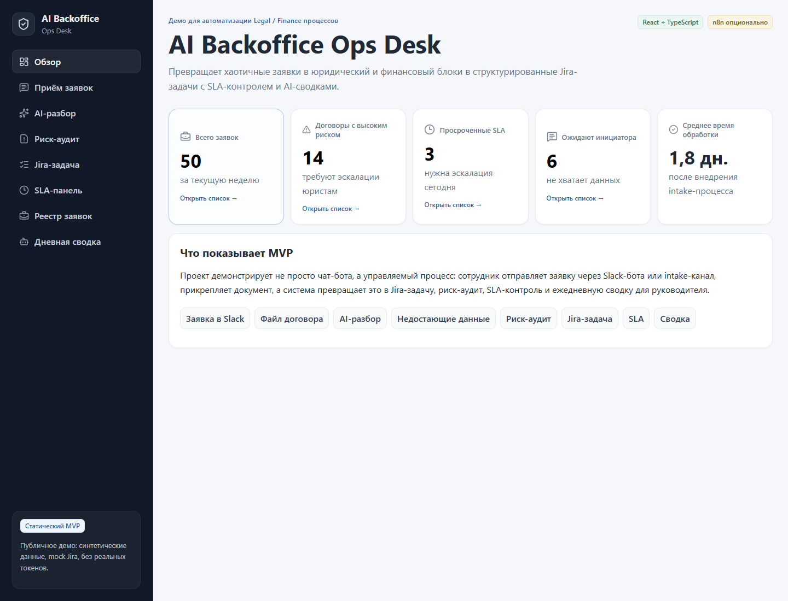
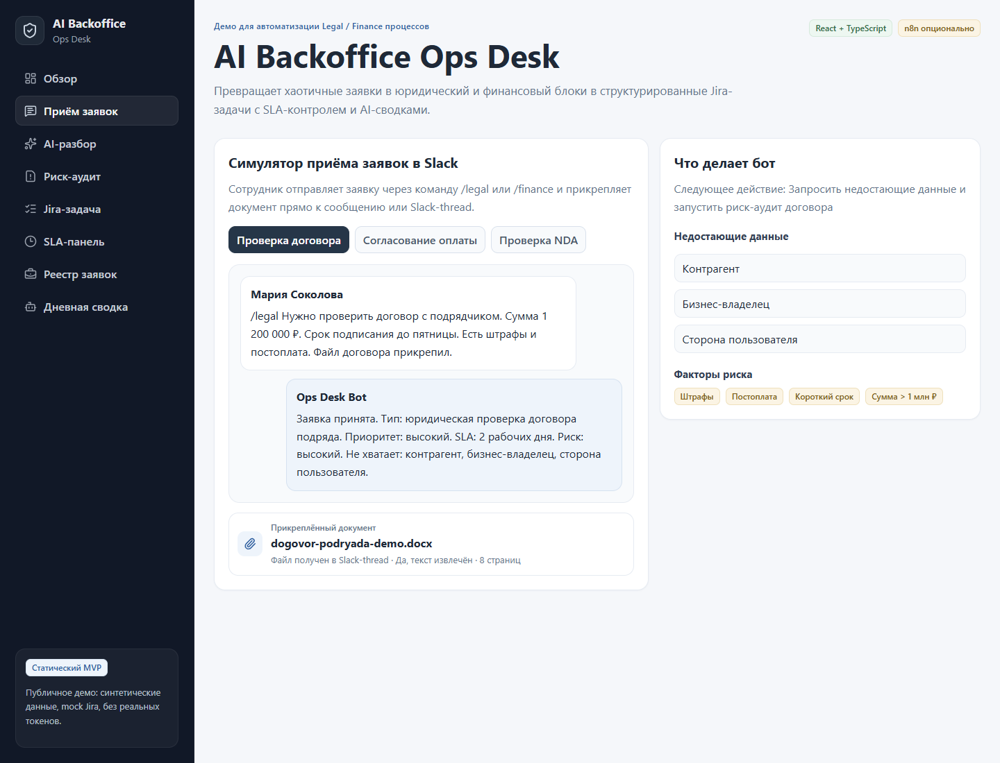
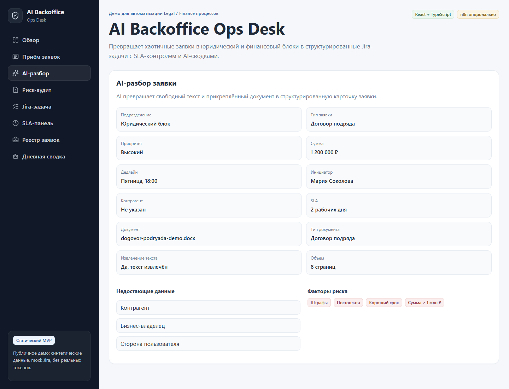
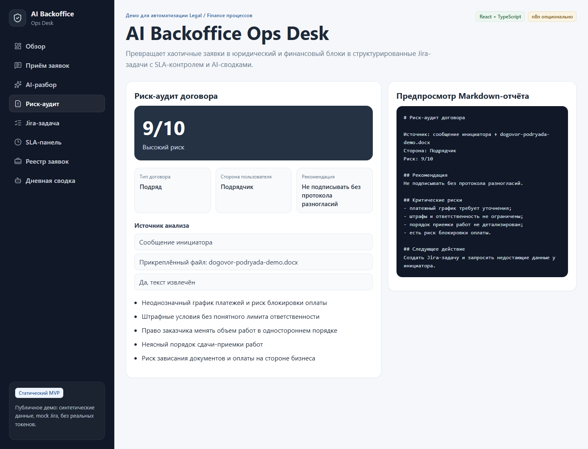
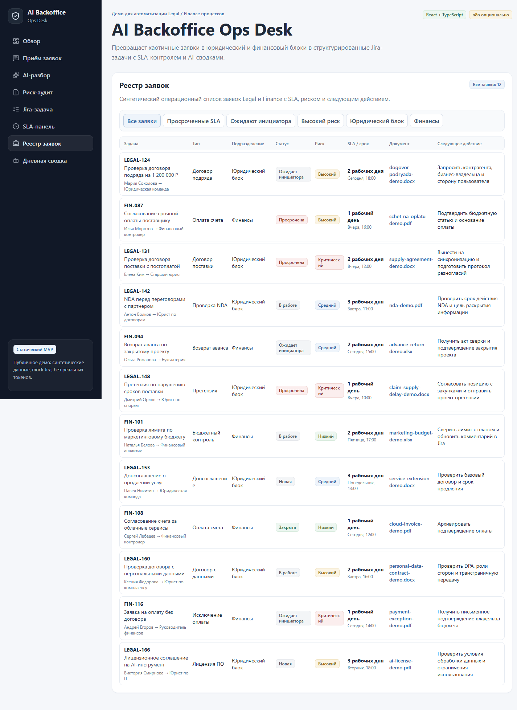
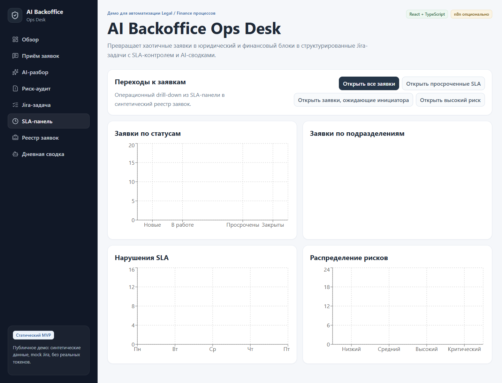
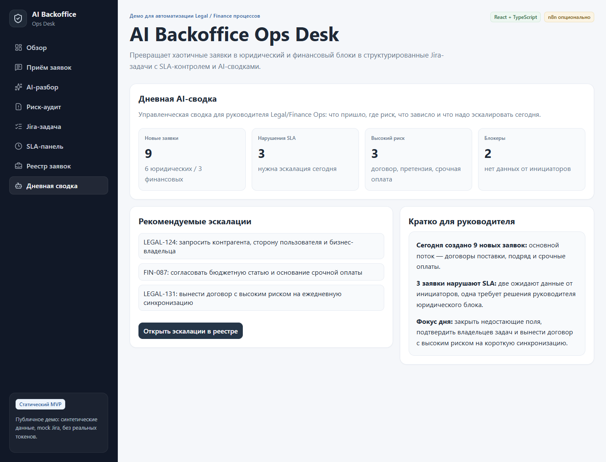

# AI Backoffice Ops Desk

> Портфолио-MVP для автоматизации Legal/Finance процессов: симулятор приёма заявок из Slack, AI-разбор заявки и прикреплённого документа, риск-аудит договора, mock Jira-задача, SLA-контроль, операционный реестр и дневная управленческая сводка.

**Демо:** `https://kilevoy.github.io/ai-backoffice-ops-desk/`  
**Статус:** MVP / статическое демо  
**Данные:** все заявки, договоры, имена, файлы и задачи являются синтетическими.

---

## Что демонстрирует проект

AI Backoffice Ops Desk показывает, как внутренний Legal/Finance-процесс можно превратить из хаотичного потока сообщений в управляемую операционную систему.

```text
Сотрудник → Slack-команда /legal или /finance → прикреплённый документ → AI-разбор → Jira-задача → SLA → реестр → сводка руководителю
```

Проект не подключён к реальным Slack/Jira/API. Это безопасное публичное демо для портфолио, которое показывает продуктовую логику, сценарии автоматизации, UX и документацию production-варианта.

---

## Скриншоты демо

### Обзор и KPI



### Приём заявки и прикреплённый документ



### AI-разбор заявки и документа



### Риск-аудит договора



### Drill-down: реестр заявок



### SLA-панель



### Дневная управленческая сводка



---

## Бизнес-проблема

Юридические и финансовые команды часто получают внутренние заявки через разные каналы: чаты, почту, личные сообщения и таблицы. Заявки приходят неполными, сроки неочевидны, владелец задачи не назначен, а статус зависит от ручных уточнений.

Типичные проблемы:

- неполные заявки доходят до Legal/Finance и тормозят работу;
- договоры и счета теряются в чатах;
- Jira-задачи создаются вручную и без единого стандарта;
- SLA нарушаются, потому что нет раннего контроля;
- руководитель видит агрегаты, но не всегда может быстро провалиться в конкретные заявки;
- знания о процессе хранятся у отдельных сотрудников.

---

## Решение

AI Backoffice Ops Desk демонстрирует лёгкий операционный слой для backoffice-команд:

- принимает юридические и финансовые заявки через Slack-подобный интерфейс;
- показывает, куда сотрудник прикрепляет договор, NDA или счёт;
- определяет тип заявки, приоритет и факторы риска;
- извлекает данные из сообщения и прикреплённого документа;
- выявляет недостающие данные до старта работы;
- показывает сценарий риск-аудита договора;
- формирует mock Jira-задачу с чек-листом и SLA;
- даёт drill-down из KPI в операционный реестр заявок;
- показывает просроченные SLA, высокий риск и заявки, ожидающие инициатора;
- генерирует дневную сводку для руководителя.

MVP специально сделан статическим и безопасным для публичного портфолио. В реальной среде этот процесс можно подключить к Slack, Jira, Google Sheets и AI API через n8n, Google Apps Script или собственный backend.

---

## Возможности

- React-dashboard в стиле внутреннего enterprise-инструмента;
- симулятор приёма заявок из Slack с тремя сценариями;
- визуальный блок прикреплённого документа;
- карточка AI-разбора заявки и файла;
- предпросмотр риск-аудита договора;
- mock Jira-задача с чек-листом;
- SLA-панель с графиками;
- кликабельные KPI и drill-down в реестр;
- фильтры реестра по SLA, риску, подразделению и статусу;
- дневная AI-сводка для руководителя;
- документация для production-интеграции;
- n8n как опциональный слой реализации.

---

## Как посмотреть демо за 3 минуты

1. Откройте **Обзор** и посмотрите KPI: всего заявок, высокий риск, просроченные SLA и заявки, ожидающие инициатора.
2. Перейдите в **Приём заявок** и выберите сценарий проверки договора: видно сообщение сотрудника, ответ бота и прикреплённый файл.
3. Откройте **AI-разбор**: система показывает структуру заявки, тип документа, извлечение текста и недостающие поля.
4. Откройте **Риск-аудит**: видно риск 9/10, источник анализа и Markdown-отчёт.
5. Откройте **Jira-задачу**: показаны статус, ответственный, SLA, метки и чек-лист.
6. Нажмите KPI или откройте **Реестр заявок**: агрегаты раскрываются в список конкретных заявок.
7. Завершите просмотр разделами **SLA-панель** и **Дневная сводка**.

---

## Drill-down и реестр заявок

KPI-карточки в разделе «Обзор» и кнопки в SLA-панели позволяют перейти от агрегатов к списку конкретных синтетических заявок. Раздел «Реестр заявок» показывает задачу, тип, подразделение, статус, риск, SLA, документ и следующее действие, а фильтры помогают быстро открыть просроченные SLA, заявки, ожидающие инициатора, высокий риск, юридический блок или финансы.

Это делает демо ближе к реальной Legal/Finance Ops-системе: руководитель не просто видит число «3 просроченных SLA», а может открыть конкретные заявки и понять, что нужно сделать.

---

## Технологии

- React;
- TypeScript;
- Vite;
- Recharts;
- CSS / системный стек шрифтов с поддержкой кириллицы;
- GitHub Pages;
- опциональный production-слой: n8n / Apps Script / собственный backend.

---

## Локальный запуск

```bash
cd app
npm install
npm run dev
```

Сборка:

```bash
cd app
npm run build
```

---

## Деплой

В репозитории настроен GitHub Actions workflow для публикации `app/dist` на GitHub Pages.

Если Pages ещё не включён, нужно выбрать источник:

```text
Settings → Pages → Source: GitHub Actions
```

---

## Документация

- [Бизнес-кейс](./docs/business-case.md)
- [Карта процесса](./docs/process-map.md)
- [Сценарий 3-минутной демонстрации](./docs/demo-script.md)
- [План интеграции Slack/Jira](./docs/slack-jira-integration.md)
- [Безопасность](./docs/security-notes.md)

---

## Заметка про n8n

n8n **не требуется** для публичного статического демо. Он описан как один из возможных вариантов production-автоматизации.

```text
Slack Trigger → Нормализация заявки → AI-классификация → Извлечение данных из документа → Создание Jira-задачи → Операционный реестр → Ответ инициатору
```

---

## Безопасность

- нет реальных договоров;
- нет реальных данных компаний;
- нет API-ключей и токенов;
- нет персональных данных;
- все примеры синтетические;
- файлы договоров, счетов и NDA являются демонстрационными названиями, а не реальными документами;
- AI-анализ договора — предварительный помощник для triage, а не юридическое заключение.

---

## Релевантность для вакансий

Кейс подходит для демонстрации на роли:

- Legal Operations Specialist;
- Finance Automation Manager;
- Project Manager for Internal Automation;
- AI/Low-code Automation Manager;
- Business Process Automation Lead;
- менеджер проектов автоматизации внутренних процессов.

Проект показывает discovery-мышление, структурирование хаотичных процессов, работу с заинтересованными сторонами, контроль delivery, документацию, понимание SLA, работу с реестром заявок и практический подход к AI-автоматизации.
